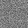

# RelativisticGAN-demo
A very simple demo of RelativisticGAN (pytorch implementation)

### Results
fake = G(z), fix z. 

epoch 0 ~ epoch 40 results:

### Usage
python main.py

### Related
[Original Repo](https://github.com/AlexiaJM/RelativisticGAN)

[Paper](https://arxiv.org/abs/1807.00734)
